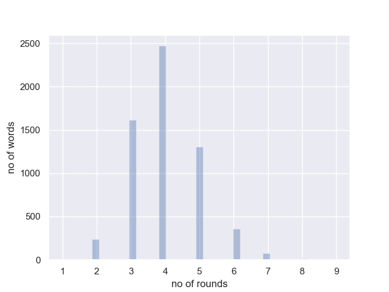
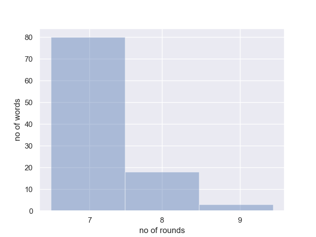

# wordle_solver
Simple heuristic assigning weight to individual letters in order to guide responses in wordle.

## Results

[Db](db/pl_pl.txt) size: **6090** words

Mean number of moves required to solve the problem: **4.041**

Number of cases when no solution was found in 6 moves: **101 (1.6585%)**

Distribution of number of tries needed to solve the problem:

Close-up on the tail of the histogram above:

